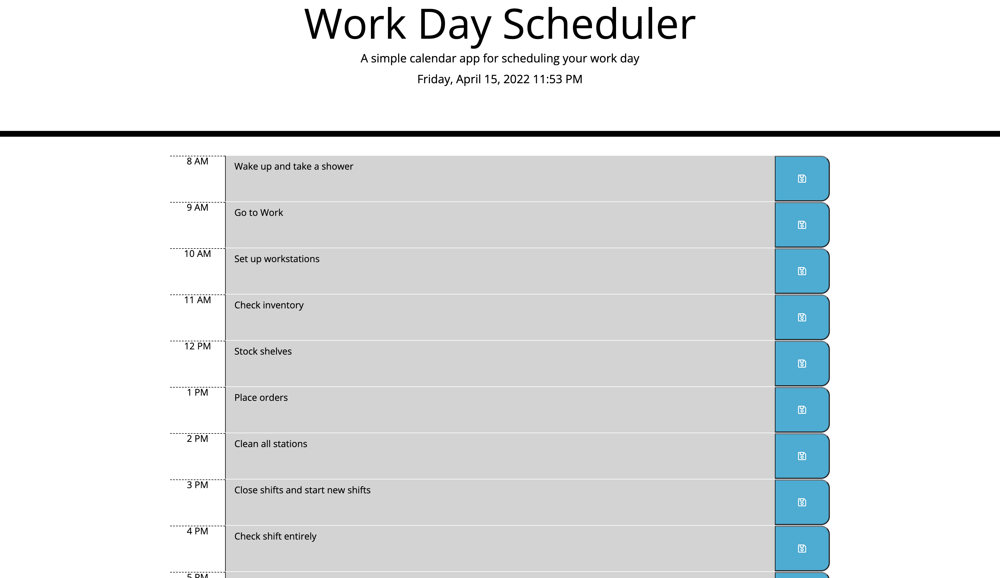
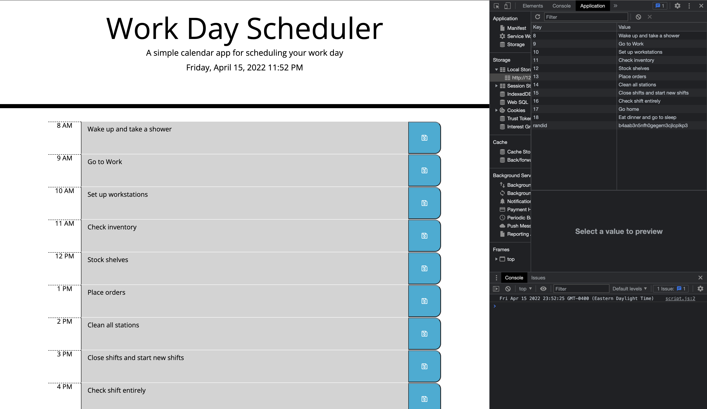

# Planet-daily
Planet Daily

# Purpose
Planet Daily is a work day scheduler that allows the user to input their daily tasks to the planner.
Planet Daily also allows the user to save the tasks and when checking the tasks they will have different colors according to the time stamps. For example if the user has a task at 8 am and the time is currently 8 am the task will show a green color. If the time passes the 8 am timeframe the 8 am will show red. 

# User Story

* AS AN employee with a busy schedule
* I WANT to add important events to a daily planner
* SO THAT I can manage my time effectively

# Acceptance Criteria
* GIVEN I am using a daily planner to create a schedule
* WHEN I open the planner
* THEN the current day is displayed at the top of the calendar
* WHEN I scroll down
* THEN I am presented with time blocks for standard business hours
* WHEN I view the time blocks for that day
* THEN each time block is color-coded to indicate whether it is in the past, present, or future
* WHEN I click into a time block
* THEN I can enter an event
* WHEN I click the save button for that time block
* THEN the text for that event is saved in local storage
* WHEN I refresh the page
* THEN the saved events persist

# Screenshots

# Made With
* HTML
* CSS
* JS

